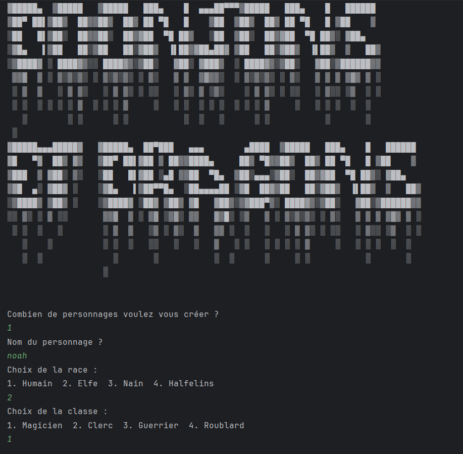
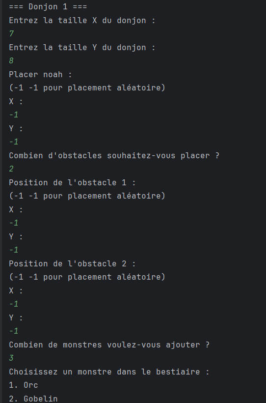
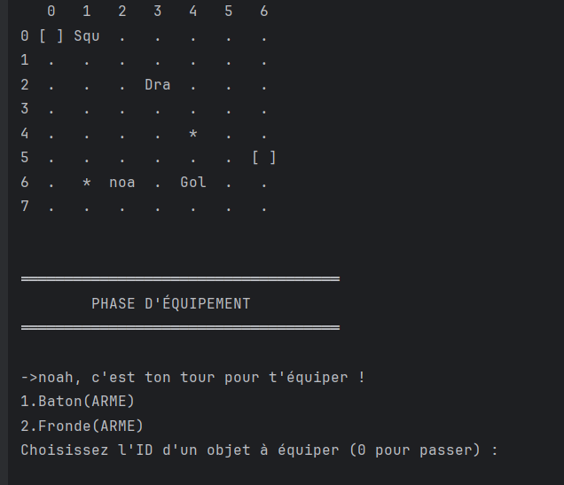

# DOOnjon&Dragon Project

Nous avoons développé une application pour **un nouveau un jeu D&D** dans le cadre d'un projet au sein de l'IUT.
C'est un jeu de rôle de Medieval Fantasy où les joueurs incarnent des personnages affrontant des monstres dans plusieurs donjons successifs.

## Organisation

- Durée : 5 semaines
- Sujet dévoilé en deux phases

  
## Le jeu *(PHASE 1)*

Il s'agit d'un jeu avec plusieurs joueurs face à des monstres contrôlés par le maître du jeu, qui se joue **au tour par tour**. Les joueurs incarnant les personnages doivent éliminer les monstres de trois donjons successifs. Un autre joueur est Maître du Jeu et a pour rôle de narrer l'histoire et expliquer le contexte aux joueurs. Si un seul joueur est éliminé par un monstre dans un des donjons, l'équipe a perdu.

 Le jeu se base sur des jets de dés désignés par <nombre de dés>d<nombre de faces des dés>.
 Par exemple, 3d4 désigne le jet de 3 dés à 4 faces.

### Les personnages

Chaque joueur à l'exception du Maître du Jeu incarne un personnage.
Chaque personnage est défini par:
- un nom
- une race parmi:
  - Humain
  - Nain
  - Elfe
  - Halfelin
- une classe parmi:
  - Guerrier
  - Clerc
  - Magicien
  - Roublard
- ses caractéristiques:
  - ses points de vie
  - sa force
  - sa dextérité
  - sa vitesse
  - son initiative
- son inventaire d'équipements en armes et armures (n'est pas limité en nombre d'équipements)
- les équipements qu'il porte (limité à une arme et une armure)

#### Les caractéristiques
- la caractéristique de points de vie indique le nombre de dégâts que peut subir un joueur avant de mourir
- la caractéristique force offre un bonus lors de l'utilisation d'une arme de corps à corps (voir Déroulement d'un donjon >  Tour d'un personnage ou d'un monstre > Attaquer)
- la caractéristique dextérité offre un bonus lors de l'utilisation de armes à distance (voir Déroulement d'un donjon >  Tour d'un personnage ou d'un monstre > Attaquer)
- la caractéristique vitesse indique la distance que peut parcourir un personnage lors d'une action (voir Déroulement d'un donjon >  Tour d'un personnage ou d'un monstre > Se déplacer)
- la caractéristique initiative offre un bonus pour déterminer l'ordre dans lequel jouera un personnage lors d'un combat dans un donjon (voir Déroulement d'un donjon >  Mise en Place)

#### Les équipements
- les armures légères
  - armure d'écailles, classe d'armure: 9
  - demi-plate,        classe d'armure: 10
- les armures lourdes
  - cotte de mailles,  classe d'armure: 11
  - harnois: classe d'armure: 12
- les armes courantes au corps-à-corps
  - bâton, dégât: 1d6, portée: 1 case
  - masse d'armes, dégât: 1d6, portée: 1 case
- les armes de guerre au corps-à-corps
  - épée longue, dégât: 1d8, portée: 1 case
  - rapière, dégât: 1d8, portée: 1 case
- les armes à distance
  - arbalète légère, dégât: 1d8, portée 16 cases
  - fronde, dégât 1d4, portée 6 cases
  - arc court, dégât 1d6, portée 16 cases

Les armes de guerre lorsqu'elles sont équipées par un personnage diminuent de 2 points leur vitesse et augmente de 4 leur force.
Les armures lourdes lorsqu'elles sont équipées par un personnage diminuent de 4 point leur vitesse.

#### Les races
- les Elfes possèdent une dextérité de base augmentée de 6 points
- les Halfelins possèdent une dextérité de base augmentée de 4 points et une vitesse de base augmentée de 2 points
- les Humains ont toutes leurs caractéristiques de base augmentée de 2 points
- les Nains ont leur force de base augmentée de 6 points

#### Les classes
- les Clercs possèdent à leur création:
  - 16 points de vie
  - un équipement de base contenant une masse d'armes, une armure d'écailles et une arbalète légère
- les Guerriers possèdent à leur création:
  - 20 points de vie,
  - un équipement contenant une cotte de mailles, une épée longue, une arbalète légère
- les Magiciens possèdent à leur création:
  - 12 points de vie
  - un équipement contenant un bâton et une fronde
- les Roublards possèdent à leur création:
  - 16 points de vie
  - un équipement contenant une rapière et un arc court

#### Création d'un personnage
Au début d'une partie, chaque joueur crée son personnage de la façon suivante:
- le joueur choisit un nom pour son personnage
- le joueur choisit une race pour son personnage
- le joueur choisit une classe pour son personnage
- la caractéristique point de vie est déterminée par la classe de son personnage
- chacune des autres caractéristique du personnage est déterminée par la somme de:
  - 4d4
  - 3 points
  - l'augmentation déterminée par la race du personnage

### Les monstres

*« Wait a minute!\
Did you hear that ? That... that sound?\
Boom !\
That didn't come from the troglodytes. No, that came from something else...\
The Demogorgon ! »\
Stranger Things, Saison 1, épisode 1*

Les monstres sont contrôlés par le maître du jeu.
Un monstre est défini par:
- son espèce (par exemple dragon)
- son numéro si plusieurs monstres de la même espèce sont présents
- son attaque (qui est unique)
    - la portée de l'attaque (valant 1 si l'attaque est au corps-à-corps)
    - les dégâts de l'attaque (choix du jet de dés)
- ses caractéristiques
  - ses points de vie
  - sa vitesse
  - sa force (0 s'il attaque à distance)
  - sa dextérité (0 s'il attaque au corps à corps)
  - sa classe d'armure
  - son initiative

En revanche un monstre ne possède pas d'équipement.

### Déroulement d'un donjon
#### Mise en Place
*«Vous entrez dans une pièce sombre et vous retrouvez face à face à ...»*

Au début de chaque donjon, le maître du jeu
- crée la carte d'un donjon: un rectangle dont les dimensions sont comprises entre 15 et 25 cases
- positionne des obstacles sur la carte: cases où les joueurs et les monstres ne pourront pas se déplacer
- crée les monstres et choisit leurs caractéristiques
- positionne les joueurs et les monstres sur la carte (en-dehors des obstacles)
- positionne des équipements sur la carte que les joueurs pourront récupérer
- présente en quelques phrases le contexte aux joueurs

Afin de faciliter la tâche au maître du jeu, un choix de mise en place du donjon par défaut devra être proposé pour chaque donjon.

Chaque joueur et chaque monstre lance 1d20 et ajoute leur caractéristique d'initiative. Ils joueront par ordre décroissant du résultat d'initiative.

Avant de débuter le donjon, chaque joueur peut équiper l'armure et l'arme de son choix.

#### Tour d'un personnage ou d'un monstre
Les tours sont joués dans l'ordre déterminé par l'initiative lors de la mise en place du donjon. Après le dernier joueur ou monstre, c'est le premier joueur ou monstre qui continue.

Lors de son tour, le joueur ou le monstre (contrôlé par le maître du jeu) peut réaliser jusqu'à 3 actions parmi. Une action consiste soit à s'équiper, soit à se déplacer, soit attaquer, soit ramasser un équipement.

A la fin de chaque action le joueur ou le maître du jeu peut commenter l'action pour améliorer le *Role Play*.

##### S'équiper *(uniquement pour les personnages)*
Un joueur peut équiper une arme ou une armure de son inventaire.
(L'arme ou l'armure précédemment équipée retourne dans l'inventaire)
Ne pas oublier de prendre alors en compte l'éventuel modificateur de vitesse dû à l'arme de guerre ou l'armure lourde lors des futurs déplacements du personnage.

##### Se Déplacer
Un joueur ou un monstre peut de déplacer d'une distance égale à sa caractéristique de vitesse divisée par 3 sur une case sans monstre, joueur ou obstacle.
L'évitement d'obstacles n'est pas pris en compte pour le calcul de la distance de déplacement.

##### Attaquer
L'attaquant attaque avec l'arme  qu'il porte.
- L'attaquant choisit la cible de son attaque(monstre dans le cas d'un attaquant personnage et personnage dans le cas d'un attaquant monstre). La cible de l'attaque  doit être à portée du joueur donnée par l'arme (les armes au corps-à-corps ont une portée d'une seule case). Les obstacles ne bloquent pas les attaques des armes à distance.
- L'attaquant commence par faire un jet d'attaque (1d20). Il ajoute ensuite au résultat du dé sa caractéristique de Dextérité s'il s'agit d'une attaque avec arme à distance et sa caractéristique de Force s'il s'agit d'une attaque avec arme au corps-à-corps.
- Si la somme est supérieur à la classe d'armure de la cible, l'attaquant lance le dé de dégât de l'arme et la cible perd en point de vies le résultat du jet de dé. Dans le cas contraire, l'attaquant finit son action sans infliger de dégâts à la cible.

#### Ramasser un équipement *(uniquement pour les personnages)*
Si un joueur est sur une case contenant un équipement (une arme ou une armure), il peut prendre l'équipement pour l'ajouter à son inventaire (l'équipement disparaît de la carte)

#### Fin d'un donjon
Un donjon se termine lorsqu'un joueur est tué (défaite) ou lorsque tous les monstres sont éliminés (victoire).

En cas de victoire, les personnages regagnent l'intégralité de leur vie et passent au donjon suivant.

### Exemple d'affichage

Il n'est pas nécessaire de reproduire le visuel tel quel mais toutes les informations doivent être présentes.

## Le jeu *(PHASE 2)*

On souhaite ajouter les fonctionnalités suivantes au jeu.

## Le maître du jeu intervient
En plus de pouvoir commenter l'action d'un joueur, le maître du jeu peut intervenir à la fin d'une action d'un joueur ou d'un monstre pour :
- déplacer un monstre ou un personnage
- par le jet de dés de son choix(nombre de dés et nombre de faces au choix), il peut infliger des dégâts à un joueur ou un monstre,
- ajouter des obstacles dans le donjon

## Sorts
Certains personnages vont se voir dotés de sorts. L'utilisation d'un sort se fait au tour de jeu du personnage doté de ce sort. L'utilisation d'un sort compte comme une action. Les monstres ne peuvent pas être dotés de sorts.
- Guérison: le personnage détenteur du sort peut choisir un personnage (y compris lui-même) et lance 1d10 pour connaître le nombre de points de vie que le personnage visé regagnera. Le personnage soigné ne peut pas dépasser le nombre de points de vie qu'il avait à sa création.
- Boogie Woogie : le personnage détenteur du sort peut choisir deux personnages (y compris lui-même), de deux monstres ou d'un personnage (y compris lui-même) et d'un monstre et échanger leur position dans le donjon.  
- Arme magique : le personnage détenteur du pouvoir peut choisir une arme détenue par un personnage (mais pas forcément équipée) à améliorer. L'arme gagne alors un bonus de 1 lors des jets d'attaque et de 1 lors des jets de dégâts (les bonus peuvent se cumuler).

Les personnages de classe Clerc peuvent lancer le sort Guérison. Les magiciens peuvent lancer n'importe quel sort.

## Une nouvelle arme
Une nouvelle arme de guerre est disponible pour toujours plus de sang !
- l'épée à deux mains, dégât: 2d6, portée: 1 case

### Fin du jeu

À la fin du jeu, un écran affiche "Vous avez perdu" ou "Vous avez gagné" et indique la cause de la défaite ou de la victoire.
